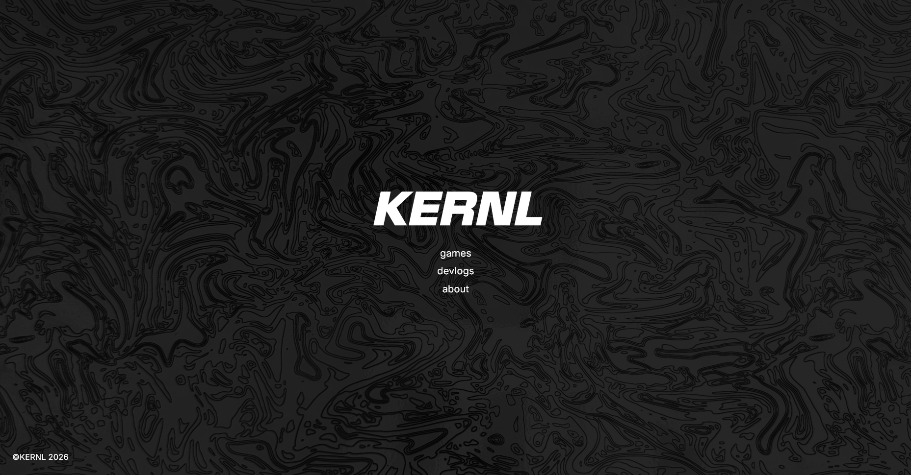
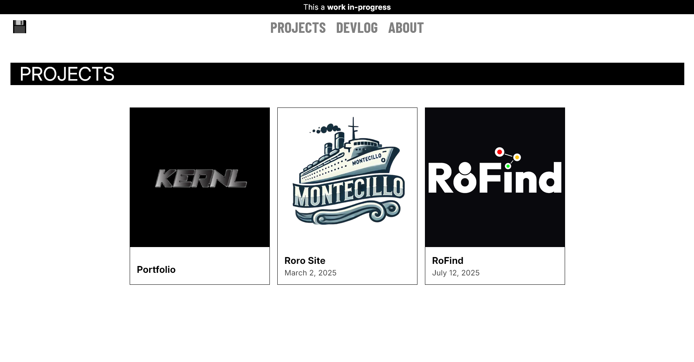
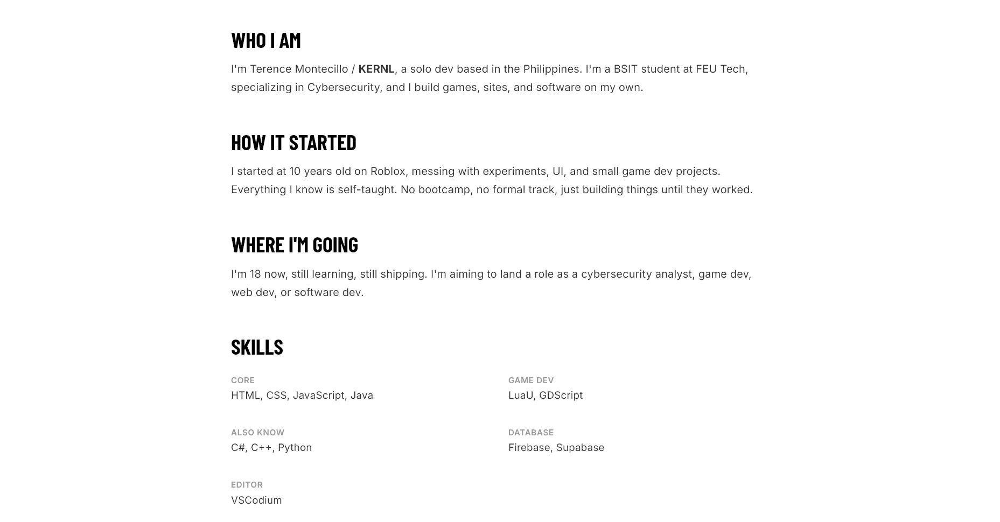

# KERNL Archives
_**KERNL Archives** is my a personal website for archiving projects!_

    
    
    

    

## History
This project started originally as a shop ecommerce website practice copy inspired from [ARKE Keycaps website](https://arke.gumroad.com/). I really loved its simple black and white design! So I repurposed its original code to be transformed into this archive and also ported it into React.js from vanilla HTML.

## Message for the visitors
This project has been a fun one to do since it's my first time using React.js to an actual project that has full functionality rather than a experimental type of a project. Devlogs is still being gathered (from hackclub and other previous projects) before I input them into the database and cleanup redundancy so stay tuned!

## Features

- **Project archive cards** - browse past and future projects
- **Devlogs** - progress updates tied to each project (depends if I actually had a devlog for it lol)
- **Admin dashboard** – add/edit/delete Projects and Devlogs, only I can touch it
- **Admin login** - gated route at _/login_ so random access is blocked into the dashboard
- **Backend** - everything (projects/devlogs) lives in supabase so it doesn't reset on refresh

## Roadmap

- [x] Images on each card
- [x] Dashboard for managing Projects and Devlogs
- [x] Admin Login on (/login)
- [ ] Viewing more detail on each card
- [ ] Markdown support for viewing cards
- [ ] Card routes (still working on it & gathering devlogs)

## Technologies

- Framework: [React.js](https://react.dev) + Vite
- Styling: Vanilla CSS
- Backend: [Supabase](https://supabase.com)

## AI Usage

AI usage in this project is **limited** and only used for cleaning up/creating new code since I had never tried TypeScript before in a web project, and for fixing styling issues. Rest assured that the project has seen human intervention.

## Reach me!

If you want to contact me or have questions, reach me out here:

- Discord: [nbit.main](https://discord.com/users/489963091019169802)
- Email: [kernl.main@gmail.com](mailto:kernl.main@gmail.com)
- Hackclub: [KERNL](https://hackclub.enterprise.slack.com/team/U091QDXSFRT) (i am often online here)

## License
This project is __PERSONALY FOR__ KERNL only! (this a personal project not a template)

See license: `LICENSE`